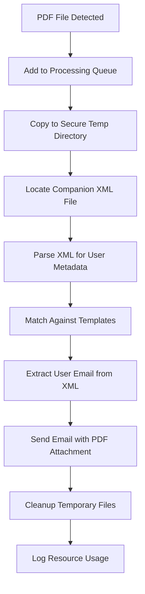

# PDF Watcher Service

[](https://www.python.org/downloads/)
[](https://opensource.org/licenses/MIT)
[](https://github.com/psf/black)

## Overview

The PDF Watcher Service is a production-grade Windows service that monitors designated directories for new PDF files and automatically processes them according to predefined templates. The service integrates with Synergy credit union core processing systems, extracting user information from companion XML files and sending targeted email notifications with intelligent CC functionality.

## Key Features

- **Real-time PDF Monitoring**: Watches specified directories using Windows file system events
- **Template-based Processing**: Configurable templates for different PDF types (Wire Transfers, Debit Card Limits)
- **XML Metadata Integration**: Automatically extracts user information from companion XML files for intelligent email routing
- **Secure Email Notifications**: Sends emails with PDF attachments and user-specific CC recipients
- **Resource Monitoring**: Comprehensive CPU and memory usage tracking with configurable alerts
- **Enterprise Security**: Path traversal protection, PII masking, secure temporary file handling
- **Robust Error Handling**: Retry logic, graceful failure recovery, and comprehensive logging
- **Production Ready**: Service lifecycle management, health monitoring, and performance metrics

## Architecture

### Core Components

1. **`pdf_watcher_service.py`** - Main Windows service framework and lifecycle management
2. **`pdf_handler.py`** - PDF processing engine with template matching and queue management  
3. **`xml_handler.py`** - XML parsing for Synergy metadata extraction and user identification
4. **`email_utils.py`** - SMTP client with retry logic and attachment handling
5. **`file_handler.py`** - Secure file operations with validation and retry mechanisms
6. **`config.py`** - Configuration management with environment variable validation

### Processing Workflow



## Configuration

### Required Environment Variables

| Variable | Description | Example |
|----------|-------------|---------|
| `PDF_WATCH_DIRECTORY` | Directory to monitor for new PDFs | `C:\WatchFolder` |
| `PDF_WATCHER_TEMP_DIR` | Temporary processing directory | `C:\Temp\PDFWatcher` |
| `PDF_WATCHER_LOG_DIRECTORY` | Log file location | `C:\Logs\PDFWatcher.log` |
| `PDF_WATCHER_RESOURCE_LOG_DIRECTORY` | Resource usage CSV log | `C:\Logs\Resources.csv` |
| `SMTP_DOMAIN` | SMTP server hostname | `mail.company.com` |
| `SMTP_PORT` | SMTP server port | `587` or `465` |
| `OPCON_ALERT_EMAIL` | From email address | `alerts@company.com` |
| `ERROR_EMAIL_TO` | Error notification recipients | `admin@company.com,it@company.com` |
| `EMAIL_DOMAIN` | Domain for user email generation | `COMPANY.COM` |

### Template Configuration

Templates define how different PDF types are processed:

#### Wire Transfer Template
- `WIRE_XFER_PDF_PATTERN` - Regex pattern to match wire transfer PDFs
- `WIRE_XFER_EMAIL_TO` - Comma-separated recipient list
- `WIRE_XFER_SUBJECT` - Email subject template with regex group placeholders
- `WIRE_XFER_BODY` - Email body content

#### Debit Card Limit Template
- `DC_LIMIT_PDF_PATTERN` - Regex pattern to match debit limit PDFs
- `DC_LIMIT_EMAIL_TO` - Comma-separated recipient list
- `DC_LIMIT_SUBJECT` - Email subject template
- `DC_LIMIT_BODY` - Email body content

### Optional Configuration

| Variable | Default | Description |
|----------|---------|-------------|
| `PDF_RENAME_FORMAT` | `{base}_{timestamp}.pdf` | File renaming pattern |
| `CLEANUP_INTERVAL` | `3600` | Temp file cleanup interval (seconds) |
| `SLEEP_INTERVAL` | `0.1` | Main loop sleep interval |

## XML Metadata Integration

The service can automatically extract user information from companion XML files that share the same base filename as the PDF. This enables automatic CC functionality for email notifications.

### XML File Discovery

- Looks for `filename.xml` alongside `filename.pdf`
- Supports both `.xml` and `.XML` extensions
- XML files must exist in the same directory as the PDF

### Supported XML Structures

The XML parser supports multiple common XML structures:

1. **Direct index elements**: `<index name="USER NAME" value="John Doe"/>`
2. **Field elements**: `<field name="USER NAME">John Doe</field>`
3. **Property elements**: `<property name="USER NAME" value="John Doe"/>`
4. **Direct child elements**: `<USER_NAME>John Doe</USER_NAME>`

### User Name Field Mapping

The service searches for user names in these XML fields (case-insensitive):
- `USER NAME`, `USER_NAME`, `UserName`, `User Name`
- `USERNAME`, `user_name`, `username`, `User`
- `SUBMITTER`, `Submitter`, `submitter`
- `SUBMITTED_BY`, `SubmittedBy`, `Submitted By`

### Email Generation

User names are automatically converted to email addresses:
- `"John Doe"` → `JOHN.DOE@COMPANY.COM`
- `"Jane Smith-Wilson"` → `JANE.SMITHWILSON@COMPANY.COM`
- Special characters are removed, dots are normalized

## Installation

### Prerequisites

- **Operating System**: Windows Server 2016 or later
- **Python**: 3.8+ (3.9+ recommended for optimal performance)
- **Privileges**: Administrative access for service installation
- **Network**: SMTP server access for email notifications
- **Storage**: Adequate space for temporary file processing

### Development Setup

1. **Clone Repository**:
   ```bash
   git clone <repository-url>
   cd pdf_watcher_service
   ```

2. **Create Virtual Environment**:
   ```bash
   python -m venv venv
   venv\Scripts\activate
   ```

3. **Install Dependencies**:
   ```bash
   pip install -r requirements.txt
   ```

4. **Install Development Tools**:
   ```bash
   pip install -e .[dev]
   pre-commit install
   ```

### Production Installation

1. **System Dependencies**:
   ```cmd
   # Install Python 3.8+ from python.org
   # Ensure pip and setuptools are updated
   python -m pip install --upgrade pip setuptools
   ```

2. **Application Installation**:
   ```cmd
   pip install -r requirements.txt
   ```

3. **Environment Configuration**:
   Set all required environment variables in system environment (see Configuration section)

4. **Service Installation**:
   ```cmd
   python pdf_watcher_service.py install
   python pdf_watcher_service.py start
   ```

### Service Management

```cmd
# Service lifecycle
python pdf_watcher_service.py install    # Install service
python pdf_watcher_service.py start      # Start service  
python pdf_watcher_service.py stop       # Stop service
python pdf_watcher_service.py restart    # Restart service
python pdf_watcher_service.py remove     # Uninstall service

# Monitoring and debugging
python pdf_watcher_service.py status     # Check service status
python pdf_watcher_service.py debug      # Run in console mode
```

## Development

### Code Quality

This project uses industry-standard tools for code quality:

```bash
# Format code
black .

# Lint code  
flake8 .

# Type checking
mypy .

# Security scanning
bandit -r .

# Run all checks
pre-commit run --all-files
```

### Testing

Run the comprehensive test suite:

```bash
# Run all tests
pytest

# Run with coverage
pytest --cov=. --cov-report=html

# Run specific test categories
pytest -m unit          # Unit tests only
pytest -m integration   # Integration tests only
pytest -m "not slow"    # Exclude slow tests
```

### Test Categories

- **Unit Tests**: Fast, isolated tests for individual components
- **Integration Tests**: Tests for component interactions  
- **Performance Tests**: Load and stress testing scenarios
- **Security Tests**: Validation of security controls

### Code Organization

```
pdf_watcher_service/
├── config.py              # Configuration and environment management
├── pdf_watcher_service.py  # Main Windows service implementation
├── pdf_handler.py          # PDF processing and template matching
├── xml_handler.py          # XML parsing and user extraction
├── email_utils.py          # Email sending with attachments
├── file_handler.py         # Secure file operations
├── requirements.txt        # Production dependencies
├── pyproject.toml          # Project configuration and dev dependencies
├── tests/                  # Comprehensive test suite
│   ├── conftest.py         # Shared test fixtures
│   ├── test_config.py      # Configuration tests
│   ├── test_xml_handler.py # XML processing tests
│   └── ...                 # Additional test modules
├── docs/                   # Documentation
└── tools/                  # Utility scripts
```

## Monitoring and Maintenance

### Logging

The service generates comprehensive logs including:
- File processing events
- Email sending status
- XML parsing results
- Resource usage metrics
- Error conditions and stack traces

Log files are automatically rotated (5MB max, 5 backups retained).

### Resource Monitoring

- CPU and memory usage logged every 10 seconds to CSV
- Automatic alerts when thresholds exceeded (80% CPU, 500MB memory)
- CSV files automatically rotated daily or when exceeding 5MB

### Health Checks

The service includes built-in health monitoring:
- Observer restart on unexpected failures
- Queue size monitoring with alerts
- Disk space monitoring for temporary directories
- Email rate limiting to prevent spam

## Security Considerations

### File Security
- Temporary files created with restricted permissions (0o600/0o700)
- Path traversal protection
- Secure file deletion with retries

### Data Protection
- PII masking in all log outputs
- Email addresses redacted in logs
- Sensitive paths masked
- XML content not logged

### Email Security
- Input sanitization for email content
- Attachment size limits (10MB)
- SMTP SSL/TLS support
- Rate limiting to prevent abuse

## Troubleshooting

### Common Issues

1. **Service Won't Start**
   - Verify all environment variables are set
   - Check directory permissions
   - Review Windows Event Log

2. **PDFs Not Processing**
   - Verify watch directory exists and is accessible
   - Check template regex patterns
   - Review log files for errors

3. **Emails Not Sending**
   - Verify SMTP configuration
   - Check network connectivity
   - Review email rate limiting

4. **XML Parsing Failures**
   - Check XML file structure matches supported formats
   - Verify XML files are well-formed
   - Review XML parsing strategy logs

### Log Analysis

Key log messages to monitor:
- `"PDF Watcher Service started successfully"` - Service startup
- `"Extracted X index values from XML using strategies"` - XML parsing success
- `"Email sent to [recipients]"` - Successful processing
- `"Failed to send email after 3 attempts"` - Email delivery issues

### Performance Tuning

- Adjust `CLEANUP_INTERVAL` based on volume
- Modify `SLEEP_INTERVAL` for CPU usage optimization
- Configure email rate limits based on SMTP server capacity
- Monitor resource usage CSV for performance trends

## Support

For technical support or configuration assistance:
1. Review service logs in the configured log directory
2. Check Windows Event Viewer for service-level errors
3. Verify environment variable configuration
4. Contact IT administrator for infrastructure-related issues

## Version History

- **v4.0** - Added XML metadata integration and user CC functionality
- **v3.0** - Enhanced error handling and resource monitoring
- **v2.0** - Added template-based processing
- **v1.0** - Initial release with basic PDF monitoring