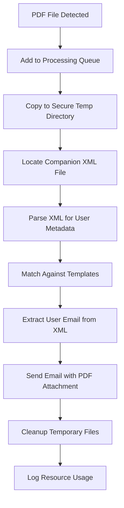

# PDF Watcher Service

[](https://www.python.org/downloads/)
[](https://opensource.org/licenses/MIT)
[](https://github.com/psf/black)

## Overview

The PDF Watcher Service is a production-grade Windows service that monitors designated directories for new PDF files and automatically processes them according to predefined templates. The service integrates with Synergy credit union core processing systems, extracting user information from companion XML files and sending targeted email notifications with intelligent CC functionality.

## Key Features

- **Real-time PDF Monitoring**: Watches specified directories using Windows file system events
- **Template-based Processing**: Configurable templates for different PDF types (Wire Transfers, Debit Card Limits)
- **XML Metadata Integration**: Automatically extracts user information from companion XML files for intelligent email routing
- **Secure Email Notifications**: Sends emails with PDF attachments and user-specific CC recipients
- **Resource Monitoring**: Comprehensive CPU and memory usage tracking with configurable alerts
- **Enterprise Security**: Path traversal protection, PII masking, secure temporary file handling
- **Robust Error Handling**: Retry logic, graceful failure recovery, and comprehensive logging
- **Production Ready**: Service lifecycle management, health monitoring, and performance metrics

## Architecture

### Core Components

1. **`pdf_watcher_service.py`** - Main Windows service framework and lifecycle management
2. **`pdf_handler.py`** - PDF processing engine with template matching and queue management  
3. **`xml_handler.py`** - XML parsing for Synergy metadata extraction and user identification
4. **`email_utils.py`** - SMTP client with retry logic and attachment handling
5. **`file_handler.py`** - Secure file operations with validation and retry mechanisms
6. **`config.py`** - Configuration management with environment variable validation

### Processing Workflow



## Installation

### Prerequisites

- **Operating System**: Windows Server 2016 or later
- **Python**: 3.8+ (3.9+ recommended for optimal performance)
- **Privileges**: Administrative access for service installation
- **Network**: SMTP server access for email notifications
- **Storage**: Adequate space for temporary file processing

### Development Setup

1. **Navigate to Project Directory**:
   ```bash
   cd python/pdf-watcher
   ```

2. **Create Virtual Environment**:
   ```bash
   python -m venv venv
   venv\Scripts\activate  # Windows
   # source venv/bin/activate  # Linux/Mac
   ```

3. **Install Dependencies**:
   ```bash
   pip install -r requirements.txt
   ```

### Service Management

```cmd
# Service lifecycle
python pdf_watcher_service.py install    # Install service
python pdf_watcher_service.py start      # Start service  
python pdf_watcher_service.py stop       # Stop service
python pdf_watcher_service.py restart    # Restart service
python pdf_watcher_service.py remove     # Uninstall service

# Monitoring and debugging
python pdf_watcher_service.py status     # Check service status
python pdf_watcher_service.py debug      # Run in console mode
```

## Configuration

See the detailed configuration documentation in the original README for complete environment variable setup and template configuration details.

## Version History

- **v4.0** - Added XML metadata integration and user CC functionality
- **v3.0** - Enhanced error handling and resource monitoring
- **v2.0** - Added template-based processing
- **v1.0** - Initial release with basic PDF monitoring